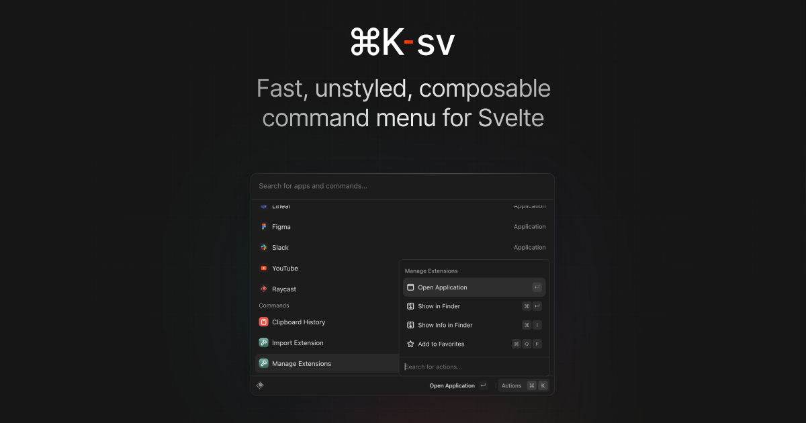

<p align="center">

</p>

# ⌘K-sv [](https://www.npmjs.com/package/cmdk-sv)

A port of [cmdk](https://cmdk.paco.me), to Svelte.

⌘K-sv is a command menu Svelte component that can also be used as an accessible combobox. You render items, it filters and sorts them automatically.

Demo and examples: [cmdk-sv.com](https://cmdk-sv.com)

## Install

```bash
npm install cmdk-sv
```

## Use

```svelte
<script lang="ts">
	import { Command } from 'cmdk-sv';
</script>

<Command.Root label="Command Menu">
	<Command.Input />
	<Command.List>
		<Command.Empty>No results found.</Command.Empty>

		<Command.Group heading="Letters">
			<Command.Item>a</Command.Item>
			<Command.Item>b</Command.Item>
			<Command.Separator />
			<Command.Item>c</Command.Item>
		</Command.Group>

		<Command.Item>Apple</Command.Item>
	</Command.List>
</Command.Root>
```

Or in a dialog:

```svelte
<script lang="ts">
	import { Command } from 'cmdk-sv';
</script>

<Command.Dialog label="Command Menu">
	<Command.Input />
	<Command.List>
		<Command.Empty>No results found.</Command.Empty>

		<Command.Group heading="Letters">
			<Command.Item>a</Command.Item>
			<Command.Item>b</Command.Item>
			<Command.Separator />
			<Command.Item>c</Command.Item>
		</Command.Group>

		<Command.Item>Apple</Command.Item>
	</Command.List>
</Command.Dialog>
```

## Styling

Each part has a specific data-attribute (starting with `data-cmdk-`) that can be used for styling.

### Command `[cmdk-root]`

Render this to show the command menu inline, or use [Dialog](#dialog-cmdk-dialog-cmdk-overlay) to render in a elevated context. Can be controlled by binding to the `value` prop.

```svelte
<script lang="ts">
	import { Command } from 'cmdk-sv';

	let value = 'apple';
</script>

<Command.Root bind:value>
	<Command.Input />
	<Command.List>
		<Command.Item>Orange</Command.Item>
		<Command.Item>Apple</Command.Item>
	</Command.List>
</Command.Root>
```

You can provide a custom `filter` function that is called to rank each item. Both strings are normalized as lowercase and trimmed.

```svelte
<Command.Root
	filter={(value, search) => {
		if (value.includes(search)) return 1;
		return 0;
	}}
/>
```

Or disable filtering and sorting entirely:

```svelte
<Command.Root shouldFilter={false}>
	<Command.List>
		{#each filteredItems as item}
			<Command.Item value={item}>
				{item}
			</Command.Item>
		{/each}
	</Command.List>
</Command.Root>
```

You can make the arrow keys wrap around the list (when you reach the end, it goes back to the first item) by setting the `loop` prop:

```svelte
<Command.Root loop />
```

This component also exposes two additional slot props for `state` (the current reactive value of the command state) and `stateStore` (the underlying writable state store). These can be used to implement more advanced use cases, such as debouncing the search updates with the `stateStore.updateState` method:

```svelte
<Command.Root {state} let:stateStore>
	{@const handleUpdateState = debounce(stateStore.updateState, 200)}
	<CustomCommandInput {handleUpdateState} />
</Command.Root>
```

### Dialog `[cmdk-dialog]` `[cmdk-overlay]`

Props are forwarded to [Command](#command-cmdk-root). Composes Bits UI's Dialog component. The overlay is always rendered. See the [Bits Documentation](https://bits-ui.com/docs/) for more information. Can be controlled by binding to the `open` prop.

```svelte
<script lang="ts">
	let open = false;
	let value: string;
</script>

<Command.Dialog bind:value bind:open>
	<!-- ... -->
</Command.Dialog>
```

You can provide a `portal` prop that accepts an HTML element that is forwarded to Bits UI's Dialog Portal component to specify which element the Dialog should portal into (defaults to `body`). To disable portalling, pass `null` as the `portal` prop.

```svelte
<Command.Dialog portal={null} />
```

### Input `[cmdk-input]`

All props are forwarded to the underlying `input` element. Can be controlled as a normal input by binding to its `value` prop.

```svelte
<script lang="ts">
	import { Command } from 'cmdk-sv';

	let search = '';
</script>

<Command.Input bind:value={search} />
```

### List `[cmdk-list]`

Contains items and groups. Animate height using the `--cmdk-list-height` CSS variable.

```css
[data-cmdk-list] {
	min-height: 300px;
	height: var(--cmdk-list-height);
	max-height: 500px;
	transition: height 100ms ease;
}
```

To scroll item into view earlier near the edges of the viewport, use scroll-padding:

```css
[data-cmdk-list] {
	scroll-padding-block-start: 8px;
	scroll-padding-block-end: 8px;
}
```

### Item `[cmdk-item]` `[data-disabled?]` `[data-selected?]`

Item that becomes active on pointer enter. You should provide a unique `value` for each item, but it will be automatically inferred from the `.textContent` if you don't. Text content is normalized as lowercase and trimmed.

```svelte
<Command.Item
	onSelect={(value) => {
		console.log('Selected', value);
		// Value is implicity "apple" because of the provided text content
	}}
>
	Apple
</Command.Item>
```

You can force an item to always render, regardless of filtering, by passing the `alwaysRender` prop.

### Group `[cmdk-group]` `[hidden?]`

Groups items together with the given `heading` (`[cmdk-group-heading]`).

```svelte
<Command.Group heading="Fruit">
	<Command.Item>Apple</Command.Item>
</Command.Group>
```

Groups will not be removed from the DOM, rather the `hidden` attribute is applied to hide it from view. This may be relevant in your styling.

You can force a group to always be visible, regardless of filtering, by passing the `alwaysRender` prop.

### Separator `[cmdk-separator]`

Visible when the search query is empty or `alwaysRender` is true, hidden otherwise.

### Empty `[cmdk-empty]`

Automatically renders when there are no results for the search query.

### Loading `[cmdk-loading]`

You should conditionally render this with `progress` while loading asynchronous items.

```svelte
<script lang="ts">
	import { Command } from 'cmdk-sv';

	let loading = false;
</script>

<Command.List>
	{#if loading}
		<Command.Loading progress={0.5}>Loading…</Command.Loading>
	{/if}
</Command.List>;
```

### `createState(initialState?: State)`

Create a state store which can be passed and used by the component. This is provided for more advanced use cases and should not be commonly used.

A good use case would be to render a more detailed empty state, like so:

```svelte
<script lang="ts">
	import { Command, createState } from 'cmdk-sv';

	const state = createState();
</script>

<Command.Root {state}>
	<Command.Empty>
		{#if $state.search}
			No results found for "{state.search}".
		{:else}
			No results found.
		{/if}
	</Command.Empty>
</Command.Root>
```

## Examples

Code snippets for common use cases.

### Nested items

Often selecting one item should navigate deeper, with a more refined set of items. For example selecting "Change theme…" should show new items "Dark theme" and "Light theme". We call these sets of items "pages", and they can be implemented with simple state:

```svelte
<script lang="ts">
	let open = false;
	let search = '';
	let pages: string[] = [];
	let page: string | undefined = undefined;

	$: page = pages[pages.length - 1];

	function changePage(newPage: string) {
		pages = [...pages, newPage];
	}
</script>

<Command
	onKeyDown={(e) => {
		// Escape goes to previous page
		// Backspace goes to previous page when search is empty
		if (e.key === 'Escape' || (e.key === 'Backspace' && !search)) {
			e.preventDefault();
			const newPages = pages.slice(0, -1);
			pages = newPages;
		}
	}}
>
	<Command.Input bind:value={search} />
	<Command.List>
		{#if !page}
			<Command.Item onSelect={() => changePage('projects')}>Search projects…</Command.Item>
			<Command.Item onSelect={() => changePage('teams')}>Join a team…</Command.Item>
		{:else if page === 'projects'}
			<Command.Item>Project A</Command.Item>
			<Command.Item>Project B</Command.Item>
		{:else if page === 'teams'}
			<Command.Item>Team 1</Command.Item>
			<Command.Item>Team 2</Command.Item>
		{/if}
	</Command.List>
</Command>
```

### Show sub-items when searching

If your items have nested sub-items that you only want to reveal when searching, render based on the search state:

```svelte
<!-- SubItem.svelte -->
<script lang="ts">
	import { Command } from 'cmdk-sv';

	type $$Props = Command.ItemProps & {
		search?: string;
	};
</script>

{#if search}
	<Command.Item {...$$restProps}>
		<slot />
	</Command.Item>
{/if}
```

Using the state store:

```svelte
<!-- CommandMenu.svelte -->
<script lang="ts">
	import { Command, createState } from 'cmdk-sv';
	import SubItem from './SubItem.svelte';
	const state = createState();
</script>

<Command.Root {state}>
	<Command.Input />
	<Command.List>
		<Command.Item>Change theme…</Command.Item>
		<SubItem search={$state.search}>Change theme to dark</SubItem>
		<SubItem search={$state.search}>Change theme to light</SubItem>
	</Command.List>
</Command.Root>
```

or

Using the input value:

```svelte
<!-- CommandMenu.svelte -->
<script lang="ts">
	import { Command } from 'cmdk-sv';
	import SubItem from './SubItem.svelte';
	let search: string;
</script>

<Command.Root>
	<Command.Input bind:value={search} />
	<Command.List>
		<Command.Item>Change theme…</Command.Item>
		<SubItem {search}>Change theme to dark</SubItem>
		<SubItem {search}>Change theme to light</SubItem>
	</Command.List>
</Command.Root>
```

### Asynchronous results

Render the items as they become available. Filtering and sorting will happen automatically.

```svelte
<script lang="ts">
	import { Command } from 'cmdk-sv';

	let loading = false;
	let items: string[] = [];

	onMount(async () => {
		loading = true;
		const res = await api.get('/dictionary');
		items = res;
		loading = false;
	});
</script>

<Command.Root>
	<Command.Input />
	<Command.List>
		{#if loading}
			<Command.Loading>Fetching words…</Command.Loading>
		{:else}
			{#each items as item}
				<Command.Item value={item}>
					{item}
				</Command.Item>
			{/each}
		{/if}
	</Command.List>
</Command.Root>
```

### Use inside Popover

We recommend using the [Bits UI popover](https://www.bits-ui.com/docs/components/popover) component. ⌘K-sv relies on the Bits UI Dialog component, so this will reduce the number of dependencies you'll need.

```bash
npm install bits-ui
```

Render `Command` inside of the popover content:

```svelte
<script lang="ts">
	import { Command } from 'cmdk-sv';
	import { Popover } from 'bits-ui';
</script>

<Popover.Root>
	<Popover.Trigger>Toggle popover</Popover.Trigger>

	<Popover.Content>
		<Command.Root>
			<Command.Input />
			<Comand.List>
				<Command.Item>Apple</Command.Item>
				</Command.List>
		</Command.Root>
	</Popover.Content>
</Popover.Root>
```

### Drop in stylesheets

You can find global stylesheets to drop in as a starting point for styling. See [src/styles/cmdk](src/styles/cmdk) for examples.

### Render Delegation

Each of the components (except the dialog) accept an `asChild` prop that can be used to render a custom element in place of the default. When using this prop, you'll need to check the components slot props to see what attributes & actions you'll need to pass to your custom element.

Components that contain only a single element will just have `attrs` & `action` slot props, or just `attrs`. Components that contain multiple elements will have an `attrs` and possibly an `actions` object whose properties are the attributes and actions for each element.

## FAQ

**Accessible?** Yes. Labeling, aria attributes, and DOM ordering tested with Voice Over and Chrome DevTools. [Dialog](#dialog-cmdk-dialog-cmdk-overlay) composes an accessible Dialog implementation.

**Filter/sort items manually?** Yes. Pass `shouldFilter={false}` to [Command](#command-cmdk-root). Better memory usage and performance. Bring your own virtualization this way.

**Unstyled?** Yes, use the listed CSS selectors.

**Weird/wrong behavior?** Make sure your `Command.Item` has a unique `value`.

**Listen for ⌘K automatically?** No, do it yourself to have full control over keybind context.

## History

Written in 2019 by Paco ([@pacocoursey](https://twitter.com/pacocoursey)) to see if a composable combobox API was possible. Used for the Vercel command menu and autocomplete by Rauno ([@raunofreiberg](https://twitter.com/raunofreiberg)) in 2020. Re-written independently in 2022 with a simpler and more performant approach. Ideas and help from Shu ([@shuding\_](https://twitter.com/shuding_)).

Ported to Svelte in 2023 by Huntabyte ([@huntabyte](https://twitter.com/huntabyte))
